# Tutorial procedure missione
## Premesse
In questo tutorial vedremo come creare una missione per il PiDay 2026, in modo da poter partecipare all'evento e ricevere il rimborso delle spese sostenute per la partecipazione.
Dato la nuova legge di bilancio dall'ultimo anno è necessario utilizzare spese tracciabili se si vuole effettuare un rimborso. Quindi tutte le spese effettuate in contanti (o forse anche Satispay) NON potranno essere rimborsate.

Per chiedere il rimoborso di una spesa è sempre necessario effettuarla tramite carta di credito/debito o prepagata (anche attraverso Apple Pay o Google Pay) e conservare la ricevuta fiscale, in questo modo sarà possibile caricare la ricevuta fiscale come giustificativo della spesa e ricevere il rimborso.

### IMPORTANTE: La missione deve essere chiusa il prima possibile (dopo averla effettuata) per non creare all'intero team problemi di bilancio!!!

La chiusura della missione avviene dopo lo svolgimento della stessa, anche il giorno dopo, durante questa fase andranno caricati i giustificativi (ricevute, biglietti, ecc) e compilati i campi relativi alle spese effettive (che potrebbero essere diverse da quelle preventivate) come indicato dallo step 11.

Compilate tutto nel migliore dei modi dato che in caso di errori le spese non vi saranno rimborsate.

## Step 1 login al portale MyPoli
Per fare il login al portale MyPoli basta utilizzare lo SPID o CIe, in questo caso dopo il login (fatto in navigazione anonima) dovreste vedere le vostre varie matricole, cliccate su quella che inizia per "d".

### Se non avete SPID o CIe (o la matricola d non compare)
In questo caso contattate l'Area IT del Poli all'interno 5050 o tramite email a 5050@polito.it e chiedete di fare il reset password del vostro account, in questo modo potrete accedere al portale MyPoli con le vostre credenziali di Ateneo (matricola d e password).
Questo è necessario dato che il vostro account d quando viene creato non ha una password, quindi è necessario fare il reset password per poter accedere al portale MyPoli.

## Step 2 accedere alla sezione "Missioni"
Cercare nella barra di ricerca in alto a destra "Missioni" e cliccare sul primo risultato, in questo modo accederete alla sezione dedicata alle missioni.
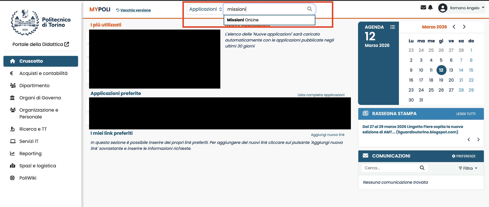

## Step 3 accedere al portale missioni
Premere sulla voce "U-Web Missioni" per accedere al portale missioni.
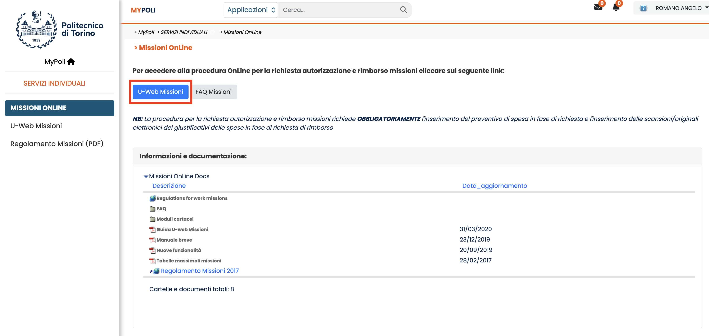
Se avete problemi ad accedere probabilmente non siete in navigazione anonima, quindi aprite una nuova finestra in navigazione anonima e ripetete i passaggi precedenti.

## Step 4 creare una nuova missione
Premere sul pulsante "Nuova Richiesta" in alto a sinistra.
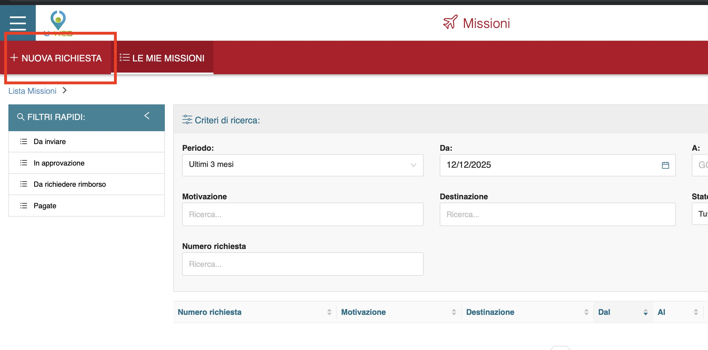

## Step 5 compilare il popup come indicato
Compilare il popup che apparirà come segue:
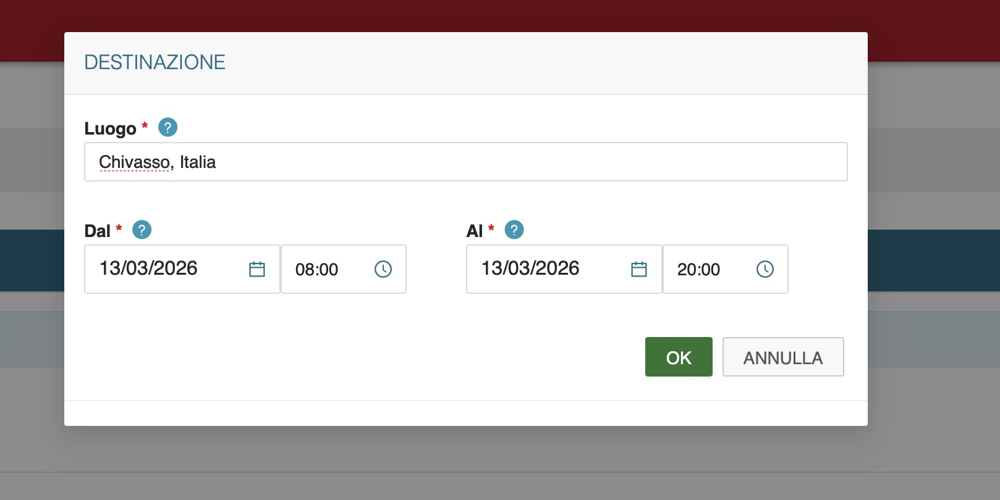

## Step 6 compilare la pagina missione
Compilare la pagina missione come segue:
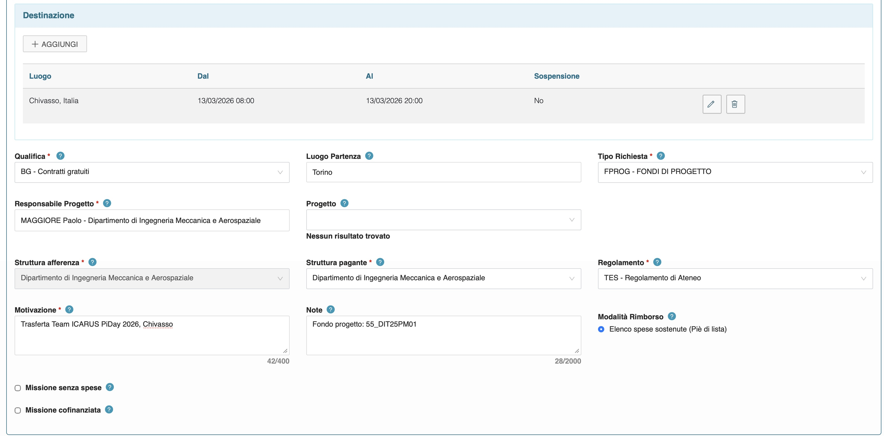

## Step 7 Aggiungere una spesa
Premere il tasto aggiungi nella voce spese a preventivo
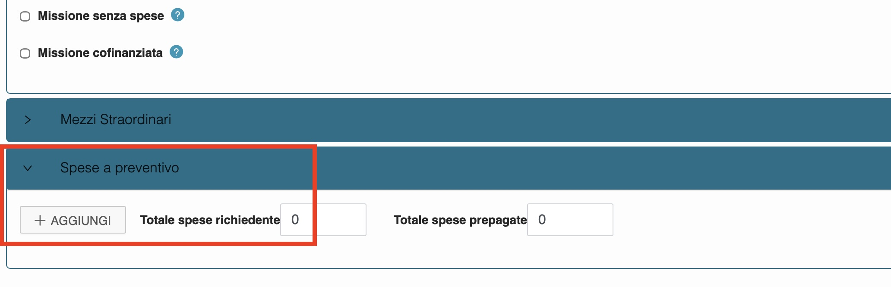

### Utilizzo mezzi propri
Se si utilizza un mezzo proprio per spostarsi non sarà possibile inserirla nelle spese a preventivo ma sarà necessario compilare la sezione "Mezzi Straordinari".
Sarà richiesto di inserire tutti i dati relativi al veicolo, inclusi targa, dati assicurativi e sul conducente.
Qui andranno inserite le spese stimate tramite calcolatore ACI o viamichelin inserendo la tratta o il numero di chilometri del percorso.

## Step 8 Compilare la spesa
Compilare la spesa come segue (esempio spesa di trasporto) e premere il tasto "OK" in basso a destra.
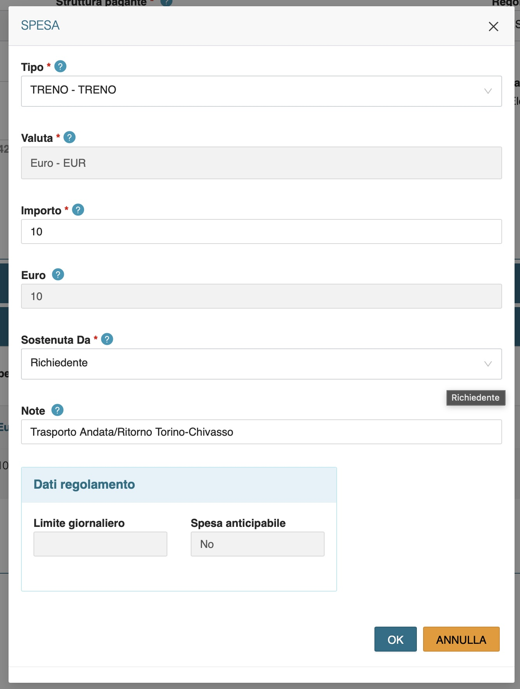

## Step 9 Inviare la missione
Dopo aver compilato tutte le spese necessarie, premere il tasto "Salva e Invia" in basso a destra per inviare la missione.
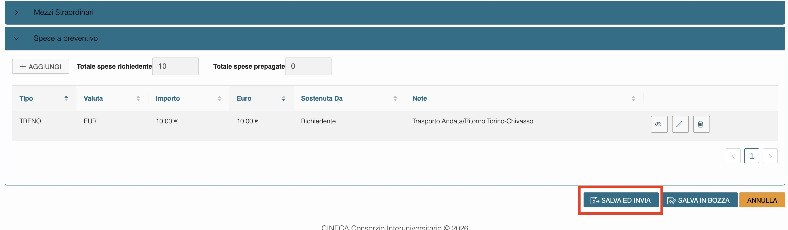

## Step 10 Attendere l'approvazione
Dopo aver inviato la missione, dovrete attendere l'approvazione da parte del docente referente, potete controllare lo stato della missione attraverso il portale nella pagina "Le mie missioni".

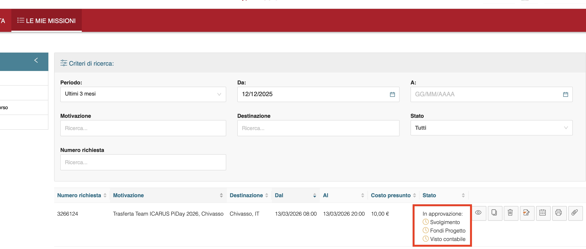

## Step 11 Chiudere la missione
Premere sul tast missione effettuata nella lista Le mie missione sul portale.
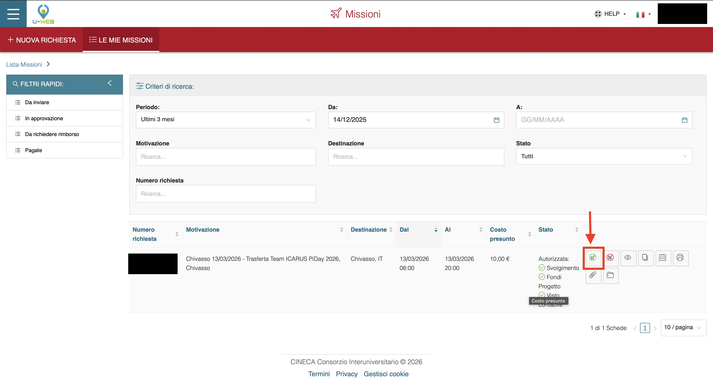

## Step 12 Compilare il rimborso
Premere sul tasto "Compila Rimborso" per accedere alla pagina di compilazione del rimborso.
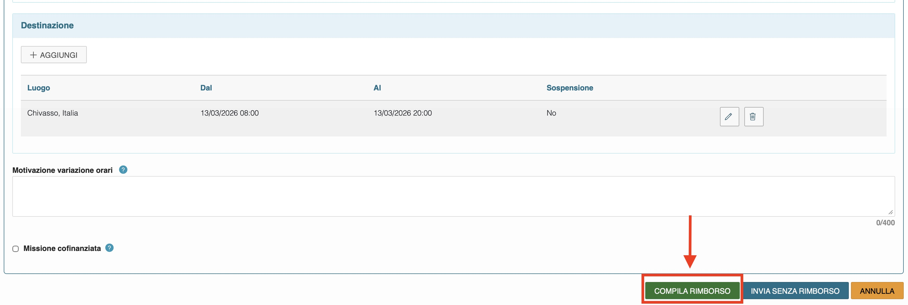

## Step 13 Inserire le voci di spesa
Aggiungere tutte le voci spesa con i relativi giustificativi (ricevute, biglietti, ecc) e compilare i campi relativi alle spese effettive. 
Per ognuna è importante inserire un giustificativo valido, altrimenti la spesa non sarà rimborsata.
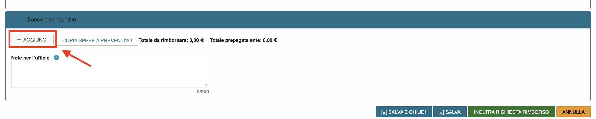

Le spese appariranno come segue in elenco, è importante che per ogni spesa sia presente in allegato il giustificativo.

Infine in caso di spese effettuate in gruppo (da evitare) indicare la frazione di rimborso da ricevere e compilarlo allo stesso modo per tutti i partecipanti alla spesa.

La spesa sarà rimborsata ad ogni membro in parti uguali, quindi se la spesa è stata effettuata da un solo membro del team, sarà necessario indicare la frazione di rimborso da ricevere per ogni membro del team (ad esempio 1/3 per un team di 3 persone).

La lista dovrebbe apparire come segue alla fine della compilazione:
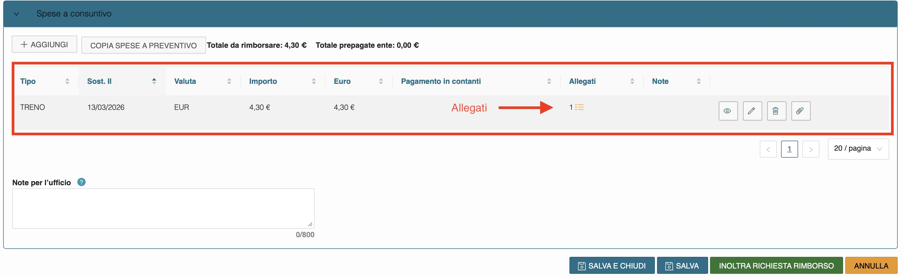

## Step 14 Inviare il rimborso
Dopo aver inserito tutte le spese e i relativi giustificativi, premere il tast "INOLTRA RICHIESTA RIMBORSO".
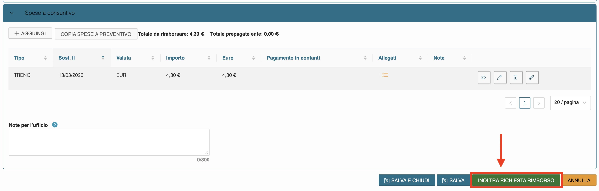

## Step 15 Attendere il rimborso
Dopo aver inviato la richiesta di rimborso dovrete attendere che venga elaborata dall'ufficio missioni, una volta elaborata riceverete il rimborso tramite bonifico sull'IBAN che avete collegato al vostro account PoliTo.
La pagina dovrebbe apparire come segue:
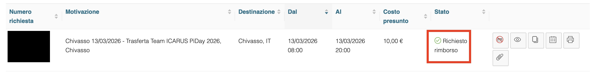
